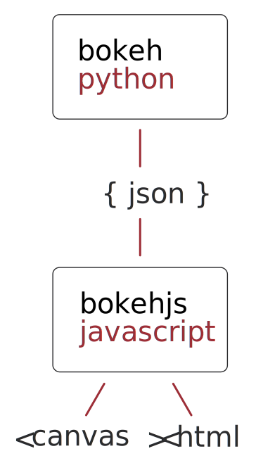

# Telling your data story with bokeh

Sarah Bird - [@birdsarah](https://twitter.com/birdsarah)

Core developer - Bokeh ([bokeh.pydata.org](http://bokeh.pydata.org/en/latest))

Software engineer - Continuum Analytics ([continuum.io](www.continuum.io))


---
## How sharp you are this morning?
* The next slide will be up for 10 seconds
* Raise your hand when you have a response

--
### How many numbers are less than 12?

<div class="bk-root"> <div class="plotdiv" id="09902c01-4615-4955-9fef-4e73eca2056f"></div> </div>

--
### How many numbers are less than 12?

<div class="bk-root">
<div class="plotdiv" id="b550ec21-08ab-415c-a30a-6a77a3be8ca7"></div>
</div>

---
<h4 class="slide-title">Telling your data story</h4>
### Telling
* Visually encode your message

---

# Exploratory
### analysis (sweat)
# Explanatory
### reporting (profit)

---

Visualizations are a powerful means to 
### tell 
#A  
###story

--

Remember to
### tell
# THE
### story
--


---
<h4 class="slide-title">Telling your data story</h4>
### Telling
* Visually encode your message

### Your data
- Be as accurate as possible


Note: 
- Telling "Prompt your audience"

--

<div class="bk-root"> <div class="plotdiv" id="ed50d3b9-2543-47e1-bbeb-38701ce63a64"></div> </div>


--

<div class="bk-root"> <div class="plotdiv" id="a2fecaf4-f01b-438f-a0c2-da12c07a6d86"></div> </div>

--

## Telling

* Prompt your audience to what they're looking at/for

> "Don't overestimate the public's knowledge. Never underestimate the public's intelligence." <br/>
<small>Gorham Munsen, The Written Word (1949)</small>

> "Assume an intelligent, impatient reader." <br/>
<small>Bryan Garnder, The Winning Brief</small>

--

## Assume an intelligent, impatient reader

Note: Have you ever received

--


--

## At the least

Don't expect someone to understand your spreadsheet:

* Break it out
* Label your axes
* Give the chart a title 
* Write an explanation

Note:
- pick the right viz
- explain the viz
- explain / show your working
- highlight your message


raw analysis < explanation ~ summary visualization < summary visualization with explanation

---
<h4 class="slide-title">Telling your data story</h4>

### Telling
* Visually encode your message
* Assume an intelligent, impatient reader

### Your data
- Be as accurate as possible


---

<div class="bk-root">
<div class="plotdiv" id="f3184bde-66b5-41c9-92a0-b6a6fd0847de"></div></div>


--

<div class="bk-root">
<div class="plotdiv" id="d15e01a7-caa3-4a82-a924-d872544e04f9"></div></div>

--

Then you get the data....

--

<div class="bk-root">
<div class="plotdiv" id="cdf3b9f3-33ad-4a8f-836b-e00a5a97bc12"></div></div>

--

* Viz doesn't work
 * over/under plotting
 * no / too much variation

* You don't have the message you thought you did

* Wasted time

Note:
- spark lines
- story wasn't what was expected
- accomodated problems that weren't there

--

## Use the real data

### Hopefully not a problem for this crowd

---

<h4 class="slide-title">Telling your data story</h4>

### Telling
* Visually encode your message
* Assume an intelligent, impatient reader

### Your data
- Be as accurate as possible
- Use the real data
---


## Creating a visualization

## Creating a story

> “Show the readers everything, tell them nothing.”<br/>
<small>Ernest Hemingway</small>


--

## SHOW AND TELL

* You have a message to tell
* Showing lets the reader "know" it for themselves
 - takes them on your journey
 - compell them with your evidence

--

### What is your message?

Sales in the SouthEast are up

--

### What is your message?

<small>The retina is the most accessible element of the central nervous system for linking behavior to the activity of isolated neurons. We unraveled behavior at the elementary level of single input units—the visual sensation generated by stimulating individual long (L), middle (M), and short (S) wavelength–sensitive cones with light. Spectrally identified cones near the fovea of human observers were targeted with small spots of light, and the type, proportion, and repeatability of the elicited sensations were recorded.Two distinct populations of cones were observed: a smaller group predominantly associated with signaling chromatic sensations and a second, more numerous population linked to achromatic percepts  Red and green sensations were mainly driven by L- and M-cones, respectively, although both cone types elicited achromatic percepts. Sensations generated by cones were rarely stochastic; rather, they were consistent over many months and were dominated by one specific perceptual category. Cones lying in the midst of a pure spectrally opponent neighborhood, an arrangement purported to be most efficient in producing chromatic signals in downstream neurons, were no more likely to signal chromatic percepts. Overall, the results are consistent with the idea that the nervous system encodes high-resolution achromatic information and lower-resolution color signals in separate pathways that emerge as early as the first synapse. The lower proportion of cones eliciting color sensations may reflect a lack of evolutionary pressure for the chromatic system to be as fine-grained as the high-acuity achromatic system.</small>

--

## Why?

--

Who?

* Report for colleagues
* Informing / influencing decisions 
* Client-facing
* Public facing


Note:

 - known and near
 - succinct messaging
 - future users
 - unknown users
 - any user
 
--

# Message

## What?
## Why?
## Who?

---

<h4 class="slide-title">Telling your data story</h4>

### Telling
* Visually encode your message
* Assume an intelligent, impatient reader

### Your data
* Be as accurate as possible
* Use your data to design

### Story
* Message - what, why, who?


---

## What is your message?

- Level of detail
- Clarity
 - accuracy
 - nuance

--

### Computer says...

```
N = 157
Xmean = 50.7333
Xsd = 19.5661
Ymean = 46.495
Ysd = 27.2828
Pearson correlation = -0.1772
```
--


credit: [@albertocairo](http://twitter.com/albertocairo)

--


--


--


--

## Build your story

## Craft a narrative

Starts to depend on what you're trying to do

---

<h4 class="slide-title">Telling your data story</h4>

### Telling
* Visually encode your message
* Assume an intelligent, impatient reader

### Your data
* Be as accurate as possible
* Use your data to design

### Story
* Message - what, why, who?
* Craft a narrative

---

# WITH BOKEH

---
<h2>Bokeh</h2>
<ul>
    <li>data visualization library
        <ul>
        <li>d3.js & many more</li>
        <li>matplotlib / seaborn</li>
        </ul>
    </li>
    <li>web</li>
    <li>interactive</li>
    <li>dynamic & data-driven</li>
    <li>roots in data science</li>
</ul>

<aside class="notes">
    <p>Bokeh is a Python interactive visualization library that
    targets modern web browsers for presentation. Its goal is
    to provide elegant, concise construction of novel graphics
    in the style of D3.js, but also deliver this capability
    with high-performance interactivity over very large or
    streaming datasets. Bokeh can help anyone who would like to
    quickly and easily create interactive plots, dashboards,
    and data applications.</p>
</aside>

--

# [SHOW ME](http://demo.bokehplots.com)
- crossfilter
- gapminder
- export csv

--

## Why bokeh?

from data science:

* interactive
* web - publishing & portability

from web dev:

* python vs javascript
* mid-sized data 1-10k | 10-100k

both:

* intuitive
* server-side processing & updating
* open-source & extensible

--

### bokeh.models (high customization)


* The lowest level
* Offers you the most control
* Do all the work yourself

<p></p>

### bokeh.plotting

* Tries to pick sensible defaults
* You organize your data, it organizes your plot

<p></p>

### bokeh.charts (high speed)

* One-line charts
* Processes your data & spits out a chart

--


## Data.....

At the heart of Bokeh is the `ColumnDataSource`

| 'column of xs' | 'column of ys'
|---|---
|0|1 
|1|2
|3|4

[notebooks/ColumnDataSource.ipynb](http://localhost:8888/notebooks/notebooks/ColumnDataSource.ipynb)

--

##[Glyphs aka Shapes](demos/glyphs.html)

--

# [Magic](http://localhost:8888/notebooks/Tools_Selection_Panning.ipynb)

--



--

## [Building up a custom visualization](http://localhost:8888/notebooks/Gapminder.ipynb)

--

## Server

--

## bokeh.charts (high speed)

* One-line charts
* **Processes your data** & spits out a chart

--

## Resources

* https://bokeh.github.io/blog/2016/10/3/resources-overview/
* YouTube videos - remember we've been moving quickly


--

---

Sumo

Voting

Gapminder

Note:

---


<h4 class="slide-title">Telling your data story</h4>

### Telling
* Visually encode your message
* Assume an intelligent, impatient reader
* Highlight illustrative examples


### Your data
* Be as accurate as possible
* Use your data to design

### Story
* Message - what, why, who?
* Craft a narrative


Note:

Message
- Write it out in plain english (plain english - visual communication is a common language)


Why Bokeh?
- a tool that can be used practically for exploration and analysis
- but leveraged for explanation
    

People don't want/need all the flashy interactions?
- but you can use interaction to support your case

Dashboards
- difficult middle ground between exploratory and explanatory


### Narrative in pieces 

### Custom visualization

---

# WITH BOKEH!


Sarah Bird - [@birdsarah](https://twitter.com/birdsarah)

Core developer - Bokeh ([bokeh.pydata.org](http://bokeh.pydata.org/en/latest))

Software engineer - Continuum Analytics ([continuum.io](www.continuum.io))